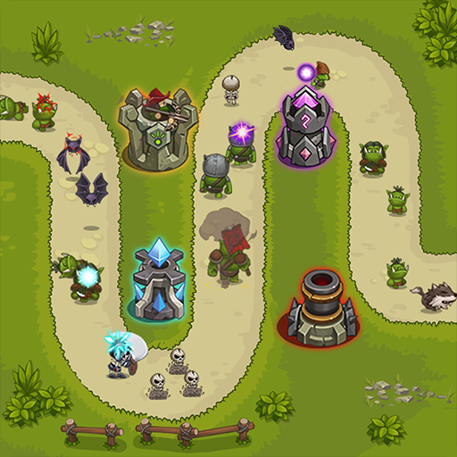
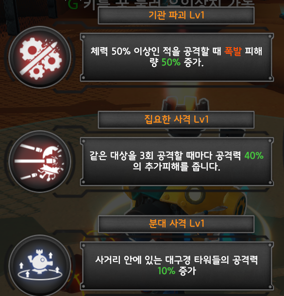

# Stack Forge

+ 게임 컨셉
> 타워를 설치하여 적군의 공격으로부터 기지를 지키는 전략 게임\
> 다양한 타워 유닛을 배치하여 적군의 진격을 막고, 각 유닛의 특성과 업그레이드를 통한 전략적 대응

+ 개발 범위
    - 서로다른 타워 3종류
    - 각 타워의 진화 버전 2종류
    - 서로 다른 적 3종류
    - 1개의 보스 몬스터
    - 10개의 Wave로 이루어진 1개의 스테이지
    - 매번 스테이지를 시작할 때 마다 랜덤으로 길을 생성하는 시스템
    - 길을 따라 움직이는 적의 길찾기 알고리즘
    
+ 예상 게임 실행 흐름
    > 스테이지 시작 시 랜덤하게 길이 생성된다.\
    > Wave가 시작되면 적들이 길을 따라 몰려온다.\
    > 타워를 설치하여 몰려오는 적을 막는다.\
    > 적을 처치하여 얻은 재화로 타워를 강화하며 더 높은 Wave를 막는다.\
    > 마지막 보스를 처치하면 스테이지를 클리어한다.

    
    > 길을 따라 몰려오는 적

    
    > 타워 강화

+ 개발 일정
    - 4월 4일 ~ 4월 10일 (1주차)
        > 프로젝트 생성 및 설정\
        > 기본 레이아웃 설정

    - 4월 11일 ~ 4월 17일 (2주차)
        > 1종의 타워 제작

    - 4월 17일 ~ 4월 24일 (3주차)
        > 1종의 적 제작\
        > 타워와 적의 상호 작용 개발

    - 4월 24일 ~ 5월 1일 (4주차)
        > 타워의 강화 효과 제작 및 구현\
        > 타워의 진화 제작

    - 5월 2일 ~ 5월 8일 (5주차)
        > 스테이지 제작\
        > 스테이지의 랜덤 길 생성 알고리즘 작성

    - 5월 9일 ~ 5월 15일 (6주차)
        > 보스 몬스터 제작\
        > 적 2종 추가\
        > 적 길찾기 알고리즘 제작

    - 5월 16일 ~ 5월 22일 (7주차)
        > 세부 UI 구현\
        > 타워 2종 추가

    - 5월 22일 ~ 5월 29일 (8주차)
        > 벨런스 조정 및 버그 수정

    - 5월 30일 ~ 6월 5일 (9주차)
        > 최종 테스트